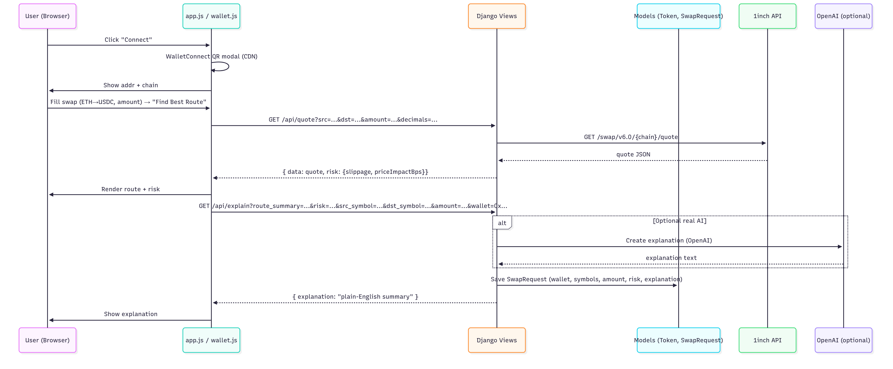

# SwapSage

AI-powered DeFi swap assistant that explains trades in simple language.

## What it does

- Connect wallet and select tokens to swap
- Get AI explanations of how your swap works
- See risks like slippage and gas costs
- Execute swaps with 1inch API


## Tech Stack

**Frontend:** Next.js + TypeScript + Tailwind  
**Backend:** Django + OpenAI API  
**APIs:** 1inch aggregation, price feeds, wallet balances


## Architecture & Data Flow



## Setup

### Frontend
```bash
cd frontend
npm install
npm run dev
```

### Backend  
```bash
cd backend
pip install -r requirements.txt
python manage.py runserver
```

### Environment Variables
```
NEXT_PUBLIC_1INCH_API_KEY=your_key
OPENAI_API_KEY=your_key
NEXT_PUBLIC_WALLETCONNECT_PROJECT_ID=your_id
```

## Features

- [x] Wallet connection
- [ ] Token selection
- [ ] AI swap explanations  
- [ ] Risk analysis
- [ ] Cross-chain swaps

## Demo

Coming soon...

---

*Building the future of DeFi UX*
